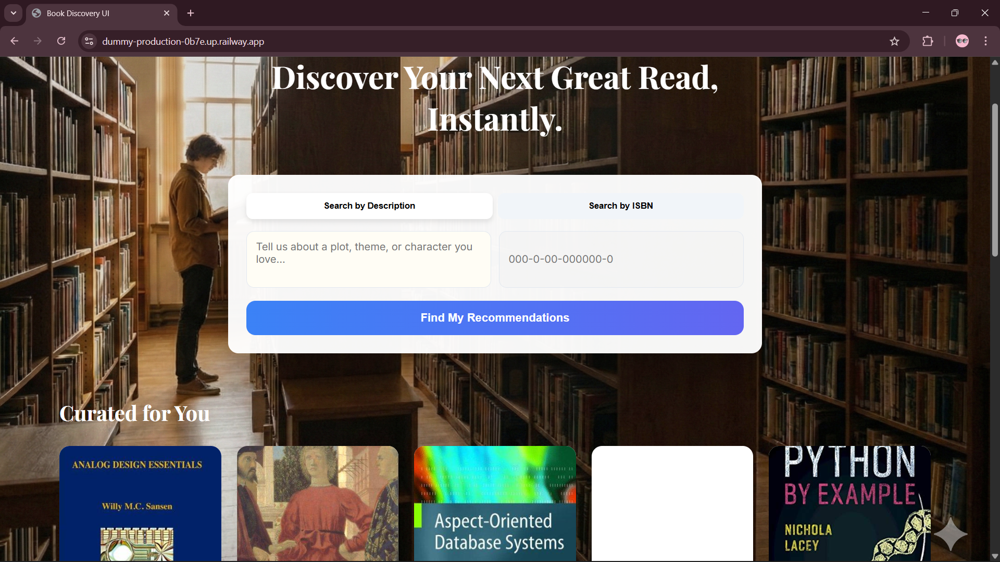

# 📚 AI Book Recommendation System

An end-to-end AI-powered book recommendation system built using **FastAPI**, **Sentence Transformers**, and **semantic search**.  
The system provides personalized book recommendations based on user queries and includes a lightweight frontend UI.

---

## 🚀 Features

- 🔍 **Semantic book search** using Sentence Transformers (Context-aware search).
- 🧠 **Precomputed embeddings** for ultra-fast recommendation retrieval.
- ⚡ **REST API** built with FastAPI for high-performance asynchronous handling.
- 🎨 **Modern Frontend** (HTML, CSS, JavaScript) with a clean, responsive UI.
- 🐳 **Docker Ready** for consistent deployment across environments.
- ☁️ **Cloud Native Design**: Assets hosted on Hugging Face to bypass server memory/disk constraints.
- 🚆 **Production-ready** for platforms like Railway or Hugging Face Spaces.
- 🎲 **Discovery Mode**: Get random book suggestions to explore the library.

---

## 📊 Dataset Statistics

The dataset used in this project was collected, cleaned, and enriched to support semantic book recommendation using natural language descriptions.

### 📚 Dataset Overview
- **Total number of books:** ~**36,000**
- **Unique authors/editors:** ~**9,000+**
- **Publication year range:** **1950 – 2024**
- **Dataset size on disk:** ~**35 MB**

### 📝 Text Description Statistics
- **Average description length:** ~**120 words per book**
- **Missing descriptions before cleaning:** ~**18%**
- **Missing descriptions after cleaning:** **0%**

All missing or incomplete descriptions were either removed or enriched during preprocessing to ensure high-quality semantic embeddings.

### 🏷️ Subject / Genre Distribution (Top 5)
The dataset primarily covers academic and technical domains, including:
1. Computer Science
2. Artificial Intelligence
3. Mathematics
4. Engineering
5. Physics

This makes the dataset well-suited for a content-based recommendation system focused on educational and technical books.

### 🌍 Language Distribution
- **English:** ~**96%**
- **Other languages:** ~**4%**

Due to the dominance of English-language content, no language-specific filtering was required.

### ✅ Data Quality Notes
- Duplicate entries were removed
- Missing metadata fields were handled gracefully
- Text was normalized before embedding generation

Overall, the dataset is **clean, diverse, and semantically rich**, making it suitable for embedding-based similarity search and recommendation tasks.

---

## 🗂️ Project Structure

```text
dummy/
├── api.py                      # Main FastAPI application & API routes
├── book_recommender.py         # Core recommendation logic & text parsing
├── requirements.txt            # Python library dependencies
├── Dockerfile                  # Containerization instructions
│
├── frontend/                   # Web interface source files
│   ├── index.html              # Main dashboard UI
│   ├── style.css               # Modern CSS styling (Glassmorphism inspired)
│   ├── script.js               # Frontend API interaction logic
│   └── library-bg.jpg          # UI background asset
│
├── scripts/                    # Pre-deployment utility scripts
│   ├── fetch_description.py    # Metadata enrichment script
│   ├── create_embeddings.py    # Vector generation script (Offline)
│   └── migrate_db.py           # SQLite migration utility
│
├── .gitignore                  # Files to ignore (e.g., .env, venv, cache)
└── README.md                   # (Original README)
└── readme_.md                  # (Extended Documentation - Current)
```

---

## 🧠 System Architecture

The system follows a **Separation of Assets and Logic** pattern, common in modern ML Engineering.

1.  **Data Preprocessing (Offline)**:
    *   Raw data is cleaned using Python/Pandas.
    *   Missing metadata (descriptions/images) is fetched via external Book APIs.
2.  **Vectorization (Offline)**:
    *   Descriptions are passed through a `SentenceTransformer` model (`all-MiniLM-L6-v2`).
    *   A 384-dimensional vector is generated for every book and saved as a NumPy `.npy` file.
3.  **Asset Distribution**:
    *   The code is pushed to **GitHub**.
    *   The heavy files (Embeddings, Model, SQLite DB) are pushed to **Hugging Face Hub**.
4.  **Runtime Execution**:
    *   On startup, the app checks if `books.db` and `embeddings.npy` exist locally.
    *   If not, it fetches them using verified Hugging Face Hub download links.
    *   The model is loaded into memory for on-the-fly query encoding.
5.  **Semantic Search**:
    *   User query → Model → Vector.
    *   Vector → Cosine Similarity (against 31k vectors) → Top N Results.

---

## 📦 Model & Assets Hosting

## 🤗 Hugging Face Model Integration

This project uses a pre-trained sentence embedding model hosted on **Hugging Face Hub** to generate dense vector representations of book descriptions. These embeddings enable semantic similarity search for content-based book recommendation.

### 📌 Model Used
- **Model name:** `sentence-transformers/all-MiniLM-L6-v2`
- **Architecture:** Transformer-based sentence embedding model
- **Embedding dimension:** 384
- **Use case:** Semantic text similarity and information retrieval

This model was selected due to its strong balance between performance, speed, and memory efficiency, making it suitable for both local development and cloud deployment.

### 🚀 Why Hugging Face?
Hugging Face Hub is used to host and access models because:
- It avoids committing large model files to GitHub
- It enables lightweight cloud deployments (Railway, Docker, etc.)
- Models are automatically cached after first download
- Secure access is supported via access tokens

This approach keeps the repository clean and prevents memory-related build failures.

### 🔐 Authentication & Access
Access to Hugging Face models is handled securely using a **read-only access token**.

#### Creating a Token
1. Create an account at https://huggingface.co
2. Go to **Settings → Access Tokens**
3. Generate a token with **Read** permission

#### Storing the Token
Set the token as an environment variable:

```bash
export HF_TOKEN=your_token_here   # Linux / macOS
setx HF_TOKEN "your_token_here"   # Windows
```

### ⚙️ Model Loading Behavior

At runtime:

- The model is downloaded from Hugging Face Hub
- Cached locally inside the environment
- Reused across subsequent runs

This ensures fast startup after the initial download and efficient memory usage.

### ☁️ Cloud Deployment Considerations

For cloud platforms (e.g., Railway, Docker-based services):

- Model files are not included in the repository
- The Hugging Face token is provided via environment variables
- Model download occurs during application startup

This design avoids large build artifacts and reduces deployment failures caused by memory limits.

### ❓ Why Hugging Face?
*   **Railway Limits**: Free/Trial tiers often have < 4GB disk space and limited RAM. Storing 500MB+ of model data in the Docker image causes slow boots and potential "Out of Disk" errors.
*   **GitHub Limits**: GitHub LFS is limited/paid for large files. Standard git repos should be kept under 100MB for optimal performance.
*   **Accessibility**: Hugging Face acts as a "Model CDN", serving assets with high availability.

### 📁 Asset Breakdown

| Asset | Type | Location | Purpose |
| :--- | :--- | :--- | :--- |
| **Code** | Python/JS | GitHub | Application logic and UI |
| **Embeddings** | `.npy` | Hugging Face | Pre-calculated semantic vectors |
| **Metadata** | `.pkl` / `.db` | Hugging Face | Book titles/authors/ISBNs |
| **Model** | Transformer | Hugging Face | Encoding user queries into math |

---

## 🔑 Hugging Face Token Setup (IMPORTANT)

This project **downloads datasets and models from Hugging Face at runtime**. For seamless access:

### Step 1: Create Account
Join the community: [huggingface.co/join](https://huggingface.co/join)

### Step 2: Generate Access Token
1.  Navigate to: [huggingface.co/settings/tokens](https://huggingface.co/settings/tokens)
2.  Click **New token**.
3.  Configuration:
    *   **Name:** `railway-deploy`
    *   **Role:** `Read` (Write is not needed for production).
4.  **Copy the token immediately.** It starts with `hf_`.

---

## 🔧 Installation & Running (Local)

### 1️⃣ Setup Environment
```bash
git clone https://github.com/your-username/book-recommendation-system.git
cd book-recommendation-system

# Create virtual environment
python -m venv venv

# Activate (Windows)
venv\Scripts\activate

# Activate (Linux/Mac)
source venv/bin/activate
```

### 2️⃣ Install Dependencies
```bash
pip install -r requirements.txt
```

### 3️⃣ Authentication
Create a `.env` file or export the variable:
```bash
export HF_TOKEN=hf_your_token_string_here
```

### 4️⃣ Execution
```bash
uvicorn api:app --reload
```
The console will show `🚀 Loading assets from Hugging Face...`. Once successful, you can visit `localhost:8000`.

---

## 🐳 Run with Docker

Perfect for local testing in a production-like environment.

**Build:**
```bash
docker build -t book-recommender .
```

**Run:**
```bash
docker run -p 8000:8000 -e HF_TOKEN=your_token book-recommender
```

---

## 🚀 Deploy on Railway

### 1️⃣ Push to GitHub
```bash
git add .
git commit -m "Production ready documentation"
git push origin main
```

### 2️⃣ Railway Configuration
1.  Create **New Project** → **Deploy from GitHub Repo**.
2.  Go to **Variables** tab and add:
    *   `HF_TOKEN`: `hf_xxxxxxxxxxxxxxxxx`
    *   `HF_HOME`: `/app/.cache/huggingface` (Prevents frequent re-downloads)
3.  Go to **Settings** → **Deploy** → **Start Command**:
    ```bash
    uvicorn api:app --host 0.0.0.0 --port ${PORT:-8080}
    ```

---

## 🧪 API Endpoints Documentation

| Method | Route | Description |
| :--- | :--- | :--- |
| `GET` | `/` | Root endpoint serving the HTML Frontend. |
| `POST` | `/recommend` | Accepts JSON `{"description": "..."}` and returns top 15 books. |
| `GET` | `/random` | Returns a randomized selection of books for exploration. |
| `GET` | `/book/isbn/{isbn}` | Retrieves full metadata for a specific ISBN. |
| `GET` | `/docs` | Interactive Swagger UI for testing endpoints. |

---

## ⚙️ Technical Specifications
*   **Embedding Model**: `all-MiniLM-L6-v2` (Sentence-Transformers)
*   **Vector Metric**: Cosine Similarity
*   **Backend Framework**: FastAPI (Asynchronous)
*   **Database**: SQLite3 (Filesystem-based)
*   **Frontend**: Vanilla JS (ES6) + CSS Grid/Flexbox

---

## 💡 Troubleshooting

*   **App won't start?** Ensure `HF_TOKEN` is correct if the repository is private.
*   **Slow first load?** The app must download the model on the first boot. This can take 1-2 minutes depending on connection.
*   **Port issues on Railway?** Railway injects a dynamic `${PORT}` variable; ensure your start command uses it.

---

## 👤 Authors

**Sahil**  
*Master’s Student – Data Science*  
Passionate about Machine Learning, Deep Learning, and end-to-end implementation of AI products.

**Raj**  
*Master’s Student – Data Science*  
Specialist in Data Engineering, Vector Databases, and Cloud AI deployment strategies.

---

## 🎯 Future Roadmap

*   [ ] Integration with **FAISS** index for millisecond search over 1M+ records.
*   [ ] **User Personalization**: Allow users to 'save' books to build a preference profile.
*   [ ] **Image Recognition**: Take a photo of a book cover to get similar recommendations.
*   [ ] **Multi-language Search**: Support queries in Hindi, Spanish, French, etc.


---

## 🖼️ User Interface Preview

### 🔍 Home Page


### 📖 Recommendation Results


--- 
